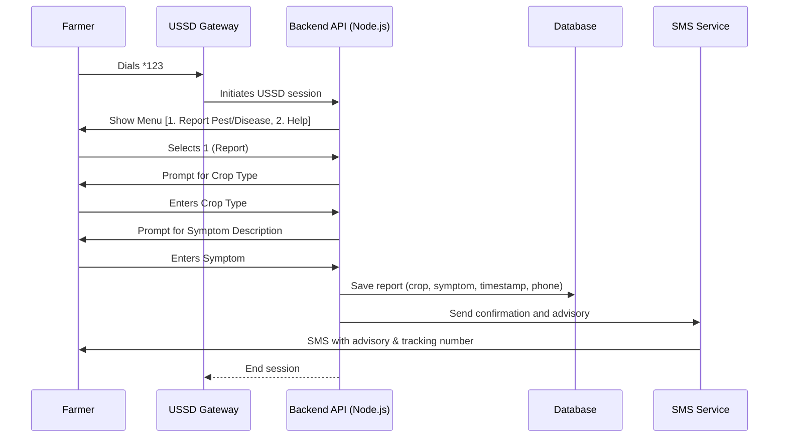
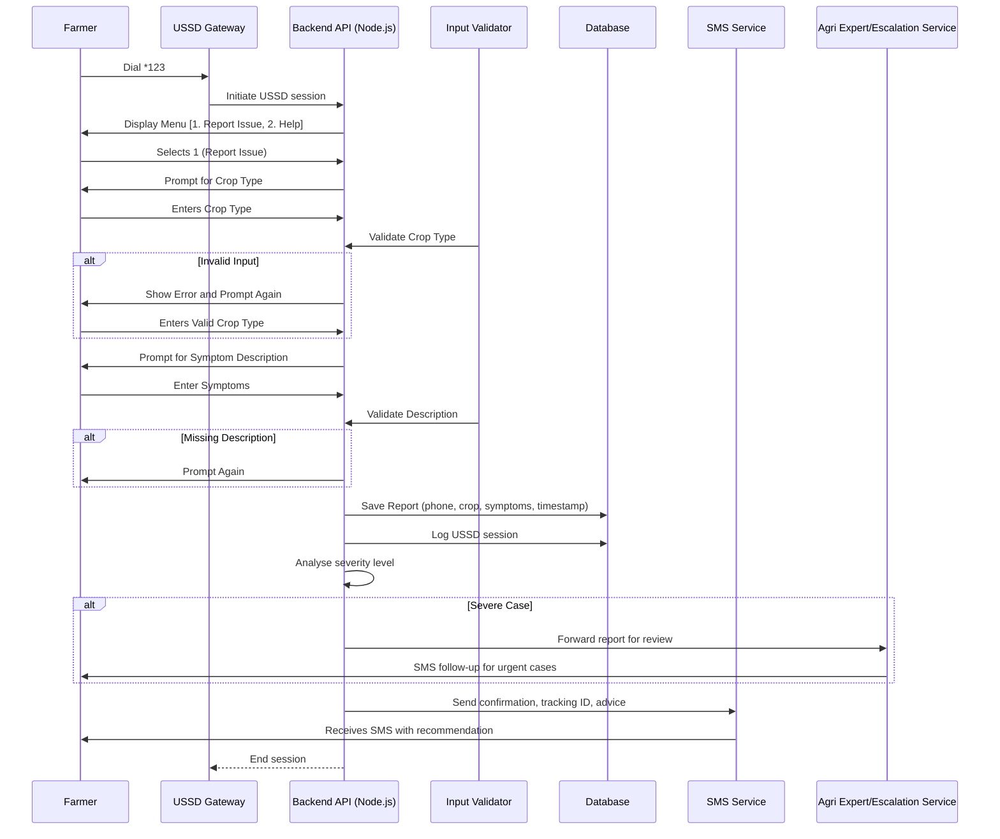

## 📘 User Stories : USSD/SMS-Based Pest & Disease Reporting System

## 👨🏾‍🌾 Farmers (End Users)

1. **USSD Access**  
   As a farmer, I want to dial a short USSD code, so that I can report pest or disease issues from my basic mobile phone without internet access.
2. **SMS-Based Reporting**  
   As a farmer, I want to send an SMS with a report, so that I can easily report issues in case I can’t use USSD.
3. **Multi-Language Support**  
   As a farmer, I want to interact with the system in my preferred local language, so that I can understand and use the system easily.
4. **Auto-Acknowledgement**  
   As a farmer, I want to receive an SMS confirmation after submitting a report, so that I know my issue has been received.

5. **Receive Advice**  
   As a farmer, I want to receive timely SMS feedback or advice from agricultural officers, so that I can take the correct action.

## 🧑🏽‍💼 Agricultural Officers

6. **Real-Time Dashboard**  
   As an agri officer, I want to view incoming reports on a dashboard, so that I can monitor pest/disease cases in real-time.

7. **Classify Reports**  
   As an agri officer, I want to classify each report by type and severity, so that I can prioritise responses appropriately.

8. **Respond to Reports**  
   As an agri officer, I want to send advice via the dashboard interface, so that farmers receive SMS responses quickly.

9. **Flag Escalated Cases**  
   As an agronomist, I want to escalate severe or unknown cases to a senior agronomist, so that experts can handle complex issues.

10. **Report Analytics**  
   As an agri officer, I want to generate a summary of reports by region, type, and response time, so that I can evaluate outreach effectiveness.

## 🛠️ Admin / System Administrator

11. **User Management**  
   As an admin, I want to manage user accounts (agri officers, support staff), so that I can control access levels.

12. **Dashboard Configuration**  
   As an admin, I want to configure region, language, and notification settings, so that the system matches local needs.

13. **Audit Logs**  
   As an admin, I want to see logs of all activities in the system, so that I can trace errors or misuse.

14. **Set Notification Rules**  
   As an admin, I want to define SMS templates and alert thresholds, so that communication is consistent and automated.

## 👨🏽‍💻 Developers

15. **API Integration**  
   As a developer, I want to build a webhook to receive USSD/SMS reports and process them by the system.

16. **Data Validation**  
   As a developer, I want to validate user input (e.g., format, content), so that incorrect reports don’t enter the system.

17. **SMS Gateway Integration**  
   As a developer, I want to integrate the app with an SMS gateway (e.g., Twilio, Africa's Talking), so that messages can be sent and received reliably.

18. **USSD Session Management**  
   As a developer, I want to manage the USSD session state so that farmers can easily complete multi-step reports.

19. **Database Schema**  
   As a developer, I want to design tables for reports, users, classifications, and messages, so that the system stores all needed data efficiently.

20. **Security**  
   As a developer, I want to implement access control and input sanitisation to ensure the system's security.

## 📈 Optional / Future Enhancements

21. **Offline Sync via Agents**  
   As a field agent, I want to log reports for farmers in remote areas and sync later, so that they’re included even without coverage.

22. **Knowledge Base Lookup**  
   As a farmer, I want to search common pest/disease solutions via USSD, so that I get answers immediately without waiting for an officer.

23. **Report Trends Visualization**  
   As an officer, I want to view map-based trends of reported cases so that I can quickly identify outbreak zones.

## High-Level Overview - Sequence Diagram

The significance of the sequence diagram is that it
- Visualises the interaction flow described in the user story.
- Clarifies backend and system involvement (what APIs or services are triggered).
- Helps developers map each step to code functions or endpoints.
- Highlights user input steps and automated responses.

## Expanded Overview Detail Sequence Diagram

### 💡 Highlights of Additions:

| Addition                          | Purpose                                                                 |
|----------------------------------|-------------------------------------------------------------------------|
| `Validator`                      | Handles bad/missing input gracefully                                   |
| `Escalation`                     | Forwards severe cases to experts for follow-up                         |
| `SMS with tracking ID`           | Helps farmers reference reports or follow up offline                   |
| `Logging session + saving report`| Ensures traceability and analytics                                     |

